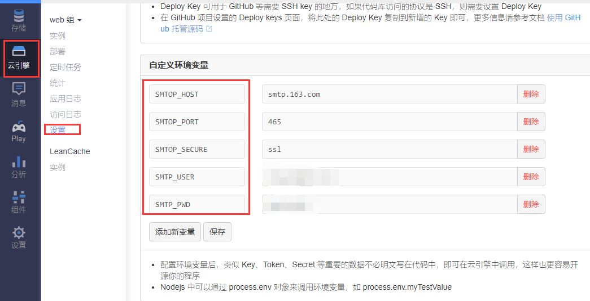

# 定时检查用户提交情况发送邮件

此仓库由复制[leancloud 官方示例](https://github.com/leancloud/node-js-getting-started)，并新增了几个云函数。

**2018-08-31**

邮件修改为直接使用云环境+nodemailer发送

需要以下配置：

```js
process.env.SMTOP_HOST, // SMTP host
process.env.SMTOP_PORT, // smtp 端口
process.env.SMTOP_SECURE, // smtp SMTOP_SECURE
process.env.SMTP_USER, // smtp 授权用户
process.env.SMTP_PWD // smtp 授权密码
```

推荐通过环境变量配置，这样不会在代码仓库中泄漏：




邮件的模板在 `sendmails.js` 中进行修改即可。

**作用**

1. 在周五给全部用户发送邮件提醒。
1. 周六、周日给未填用户发送邮件提醒。
1. 利用云函数的超级权限修改其他用户的信息。

**使用**

修改 `./cloud.js` 中 `post` 函数中的配置为自己部署的发送邮件地址即可。

```js
const options = {
  hostname: 'fe.epoint.com.cn',
  port: 8080,
  path: '/weeklyreport/mail/sendmail.php',
  method: 'POST',
  headers: {
    'Content-Type': 'application/x-www-form-urlencoded; charset=UTF-8',
    'Content-Length': Buffer.byteLength(data)
  }
};
```